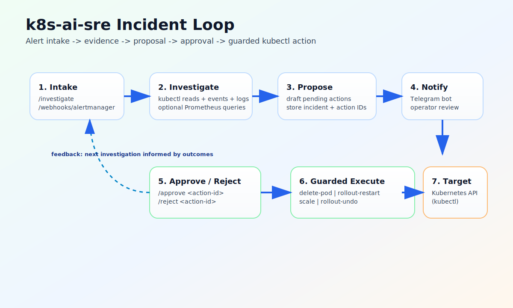

# k8s-ai-sre

> AI-assisted Kubernetes incident investigation with guarded remediation. 🤖🛡️

`k8s-ai-sre` helps you move from alert to safe action faster:

- receives a target from HTTP (`/investigate`) or Alertmanager webhook (`/webhooks/alertmanager`)
- gathers real cluster evidence with `kubectl` reads (and optional Prometheus context)
- drafts actionable remediation proposals
- requires explicit operator approval before any write action
- executes only guarded actions with namespace constraints



## Why this is useful for homelabs and small teams 🏠

When something breaks in-cluster, this project gives you one loop:

1. detect an issue
2. investigate quickly with real evidence
3. decide from proposed actions
4. approve/reject from Telegram
5. apply only guarded changes

It is designed to be practical first, not magic-first.

## What is implemented today ✅

- `FastAPI` service with:
  - `POST /investigate`
  - `POST /webhooks/alertmanager`
  - `GET /incidents`
  - `GET /incidents/{incident_id}`
  - `GET /healthz`
  - `GET /` built-in web incident inspector
- local JSON-backed storage for incidents and actions
- Telegram notification plus command handling:
  - `/incident <incident-id>`
  - `/status <incident-id>`
  - `/approve <action-id>`
  - `/reject <action-id>`
- guarded write actions:
  - `delete-pod`
  - `rollout-restart`
  - `scale`
  - `rollout-undo`
- namespace guardrails via `WRITE_ALLOWED_NAMESPACES`

## Quick start 🚀

### 1. Install dependencies

```bash
uv sync
```

### 2. Configure model access

Required:

```bash
export PORTKEY_API_KEY=...
```

Optional overrides:

```bash
export MODEL_NAME=openai/gpt-oss-20b
export MODEL_PROVIDER=groq
export MODEL_BASE_URL=https://api.portkey.ai/v1
export MODEL_API_KEY=...
```

Note: `MODEL_API_KEY` overrides `PORTKEY_API_KEY` when both are set.

### 3. Create a local demo failure

```bash
kubectl create namespace ai-sre-demo --dry-run=client -o yaml | kubectl apply -f -
kubectl apply -f examples/kind-bad-deploy.yaml
```

### 4. Run the service

```bash
uv run main.py
```

### 5. Trigger investigation

Manual target:

```bash
curl -X POST http://127.0.0.1:8080/investigate \
  -H 'Content-Type: application/json' \
  -d '{"kind":"deployment","namespace":"ai-sre-demo","name":"bad-deploy"}'
```

Alertmanager sample:

```bash
curl -X POST http://127.0.0.1:8080/webhooks/alertmanager \
  -H 'Content-Type: application/json' \
  --data @examples/alertmanager-bad-deploy.json
```

Then open the incident inspector UI:

```text
http://127.0.0.1:8080/
```

## Telegram approval loop 💬

Telegram is optional for local investigation, but required for chat-based approvals.

```bash
export TELEGRAM_BOT_TOKEN=...
export TELEGRAM_CHAT_ID=...
export TELEGRAM_ALLOWED_CHAT_IDS=...
export WRITE_ALLOWED_NAMESPACES=ai-sre-demo
```

Optional polling knobs:

```bash
export TELEGRAM_POLL_ENABLED=true
export TELEGRAM_POLL_TIMEOUT_SECONDS=30
export TELEGRAM_HTTP_TIMEOUT_SECONDS=35
export TELEGRAM_POLL_INTERVAL_SECONDS=1
export TELEGRAM_POLL_BACKOFF_SECONDS=5
```

Behavior details:

- polling starts automatically when `TELEGRAM_BOT_TOKEN` is set
- unauthorized chat IDs are ignored when `TELEGRAM_ALLOWED_CHAT_IDS` is configured
- missing command arguments return usage hints (`Usage: /approve <action-id>`, etc.)
- timeout values are validated and clamped to safe defaults when needed

## Guardrails and safety model 🔒

- write actions require explicit approve commands before execution
- write scope can be restricted to specific namespaces (`WRITE_ALLOWED_NAMESPACES`)
- `scale` rejects negative replica values
- `scale` and `rollout-undo` validate target deployment readability/existence before mutating

## Deployment ☸️

Kubernetes manifests are in [`deploy`](deploy).
Current published image reference:

```text
ghcr.io/kmjayadeep/k8s-ai-sre:main
```

Create runtime secret:

```bash
kubectl create namespace ai-sre-system --dry-run=client -o yaml | kubectl apply -f -
kubectl -n ai-sre-system create secret generic k8s-ai-sre-env \
  --from-literal=PORTKEY_API_KEY="$PORTKEY_API_KEY" \
  --from-literal=MODEL_NAME="$MODEL_NAME" \
  --from-literal=MODEL_PROVIDER="$MODEL_PROVIDER" \
  --from-literal=MODEL_BASE_URL="$MODEL_BASE_URL" \
  --from-literal=MODEL_API_KEY="$MODEL_API_KEY" \
  --from-literal=TELEGRAM_BOT_TOKEN="$TELEGRAM_BOT_TOKEN" \
  --from-literal=TELEGRAM_CHAT_ID="$TELEGRAM_CHAT_ID" \
  --from-literal=TELEGRAM_ALLOWED_CHAT_IDS="$TELEGRAM_ALLOWED_CHAT_IDS" \
  --from-literal=TELEGRAM_POLL_ENABLED="${TELEGRAM_POLL_ENABLED:-true}" \
  --from-literal=TELEGRAM_POLL_TIMEOUT_SECONDS="${TELEGRAM_POLL_TIMEOUT_SECONDS:-30}" \
  --from-literal=TELEGRAM_HTTP_TIMEOUT_SECONDS="${TELEGRAM_HTTP_TIMEOUT_SECONDS:-35}" \
  --from-literal=TELEGRAM_POLL_INTERVAL_SECONDS="${TELEGRAM_POLL_INTERVAL_SECONDS:-1}" \
  --from-literal=TELEGRAM_POLL_BACKOFF_SECONDS="${TELEGRAM_POLL_BACKOFF_SECONDS:-5}" \
  --from-literal=WRITE_ALLOWED_NAMESPACES="$WRITE_ALLOWED_NAMESPACES" \
  --dry-run=client -o yaml | kubectl apply -f -
```

Deploy:

```bash
kubectl apply -k deploy
kubectl get pods -n ai-sre-system
kubectl get svc -n ai-sre-system
```

## Architecture and code map 🧭

- [`main.py`](main.py): service boot
- [`app/http.py`](app/http.py): API routes + incident inspector UI
- [`app/ui/incident_inspector.html`](app/ui/incident_inspector.html): incident inspector web template
- [`app/investigate.py`](app/investigate.py): investigation orchestration
- [`app/tools/k8s.py`](app/tools/k8s.py): Kubernetes + Prometheus reads
- [`app/tools/actions.py`](app/tools/actions.py): guarded mutating actions
- [`app/telegram.py`](app/telegram.py): Telegram polling and command handling
- [`app/stores`](app/stores): incident/action store abstraction
- [`model_factory.py`](model_factory.py): model provider wiring

## Testing 🧪

Use [`TESTING.md`](TESTING.md) for the current runbook, including:

- local investigate flow
- Alertmanager webhook flow
- Telegram approval flow
- kind end-to-end exercise

Quick command:

```bash
uv run python -m unittest discover -s tests
```

## Documentation site

The repository includes an initial docs website scaffold for GitHub Pages:

- source content: `docs/`
- configuration: `mkdocs.yml`
- CI/CD workflow: `.github/workflows/docs-pages.yml`

Build locally:

```bash
uvx --with mkdocs mkdocs build --strict
```

The generated site output is written to `site/`.
