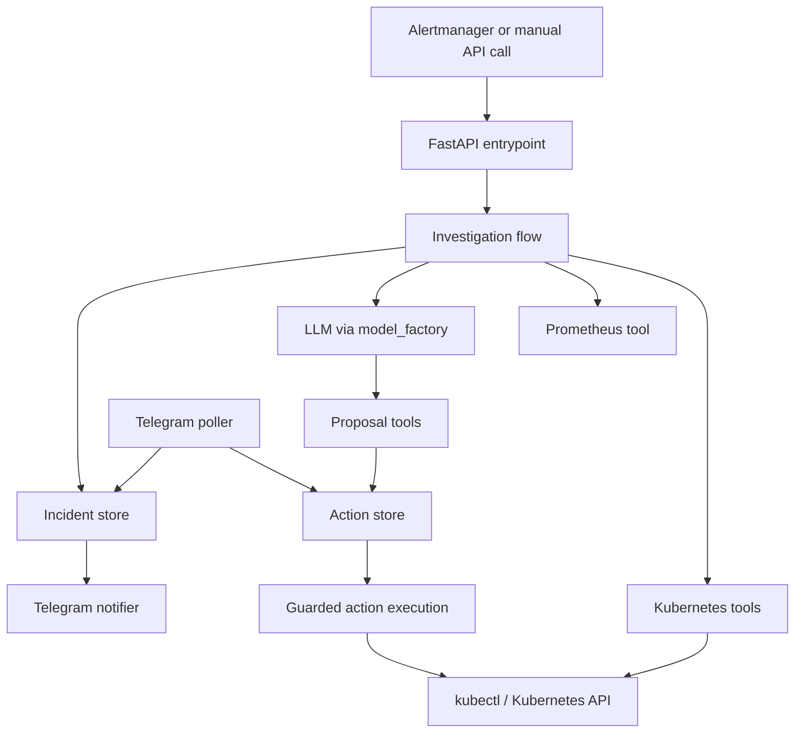

# k8s-ai-sre

`k8s-ai-sre` is an AI-assisted Kubernetes incident investigator with guarded remediation.

Today it can:

- investigate pods and deployments with real `kubectl` reads
- collect evidence from resource state, events, logs, and optional Prometheus queries
- accept Alertmanager-style webhooks
- persist incidents and pending actions locally
- notify and approve actions through Telegram
- execute guarded actions only after explicit approval

The intended loop is:

1. an alert or manual request targets a Kubernetes object
2. the agent gathers evidence and explains the likely cause
3. the agent can create pending remediation proposals
4. an operator approves or rejects those proposals
5. approved actions execute through the existing guardrails

## Architecture



Component guide:

- [main.py](main.py): server entrypoint
- [app/http.py](app/http.py): HTTP endpoints for investigations and Alertmanager webhooks
- [app/investigate.py](app/investigate.py): agent orchestration
- [app/tools/k8s.py](app/tools/k8s.py): Kubernetes and Prometheus read helpers
- [app/tools/actions.py](app/tools/actions.py): guarded action execution helpers
- [app/telegram.py](app/telegram.py): Telegram polling and commands
- [app/stores](app/stores): local JSON stores for incidents and actions
- [model_factory.py](model_factory.py): model selection and client configuration

## Quick Start

### 1. Install Dependencies

```bash
uv sync
```

### 2. Configure The Model

Minimum configuration:

```bash
export PORTKEY_API_KEY=...
```

Optional overrides:

```bash
export MODEL_NAME=openai/gpt-oss-20b
export MODEL_PROVIDER=groq
export MODEL_BASE_URL=https://api.portkey.ai/v1
export MODEL_API_KEY=...
```

`MODEL_API_KEY` overrides `PORTKEY_API_KEY` when both are set.

### 3. Prepare A Local Scenario

```bash
kubectl create namespace ai-sre-demo --dry-run=client -o yaml | kubectl apply -f -
kubectl apply -f examples/kind-bad-deploy.yaml
```

### 4. Run The Service

```bash
uv run main.py
```

### 5. Trigger An Investigation

```bash
curl -X POST http://127.0.0.1:8080/investigate \
  -H 'Content-Type: application/json' \
  -d '{"kind":"deployment","namespace":"ai-sre-demo","name":"bad-deploy"}'
```

Or send a sample webhook:

```bash
curl -X POST http://127.0.0.1:8080/webhooks/alertmanager \
  -H 'Content-Type: application/json' \
  --data @examples/alertmanager-bad-deploy.json
```

## Telegram Flow

Telegram is optional for local investigation, but required for the chat approval loop.

Typical variables:

```bash
export TELEGRAM_BOT_TOKEN=...
export TELEGRAM_CHAT_ID=...
export TELEGRAM_ALLOWED_CHAT_IDS=...
export WRITE_ALLOWED_NAMESPACES=ai-sre-demo
```

Supported commands:

- `/incident <incident-id>`
- `/status <incident-id>`
- `/approve <action-id>`
- `/reject <action-id>`

The server starts the Telegram polling loop automatically when `TELEGRAM_BOT_TOKEN` is configured.
Missing or malformed command arguments now return explicit usage messages in chat.

## Guarded Actions

The current guarded actions are:

- `delete-pod`
- `rollout-restart`
- `scale`
- `rollout-undo`

They are namespace-restricted through `WRITE_ALLOWED_NAMESPACES` and require explicit approval before execution.

## Deployment

The Kubernetes manifests are in [deploy](deploy) and deploy the published image:

```text
ghcr.io/kmjayadeep/k8s-ai-sre:main
```

Create the runtime secret:

```bash
kubectl create namespace ai-sre-system --dry-run=client -o yaml | kubectl apply -f -
kubectl -n ai-sre-system create secret generic k8s-ai-sre-env \
  --from-literal=PORTKEY_API_KEY="$PORTKEY_API_KEY" \
  --from-literal=MODEL_NAME="$MODEL_NAME" \
  --from-literal=MODEL_PROVIDER="$MODEL_PROVIDER" \
  --from-literal=MODEL_BASE_URL="$MODEL_BASE_URL" \
  --from-literal=MODEL_API_KEY="$MODEL_API_KEY" \
  --from-literal=TELEGRAM_BOT_TOKEN="$TELEGRAM_BOT_TOKEN" \
  --from-literal=TELEGRAM_CHAT_ID="$TELEGRAM_CHAT_ID" \
  --from-literal=TELEGRAM_ALLOWED_CHAT_IDS="$TELEGRAM_ALLOWED_CHAT_IDS" \
  --from-literal=WRITE_ALLOWED_NAMESPACES="$WRITE_ALLOWED_NAMESPACES" \
  --dry-run=client -o yaml | kubectl apply -f -
```

Deploy:

```bash
kubectl apply -k deploy
kubectl get pods -n ai-sre-system
kubectl get svc -n ai-sre-system
```

## Testing

See [TESTING.md](TESTING.md) for the concise current runbook:

- local investigation
- local server plus webhook
- Telegram approval flow
- live kind end-to-end exercise
